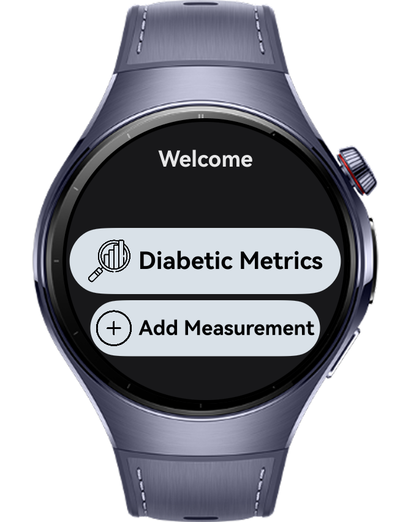
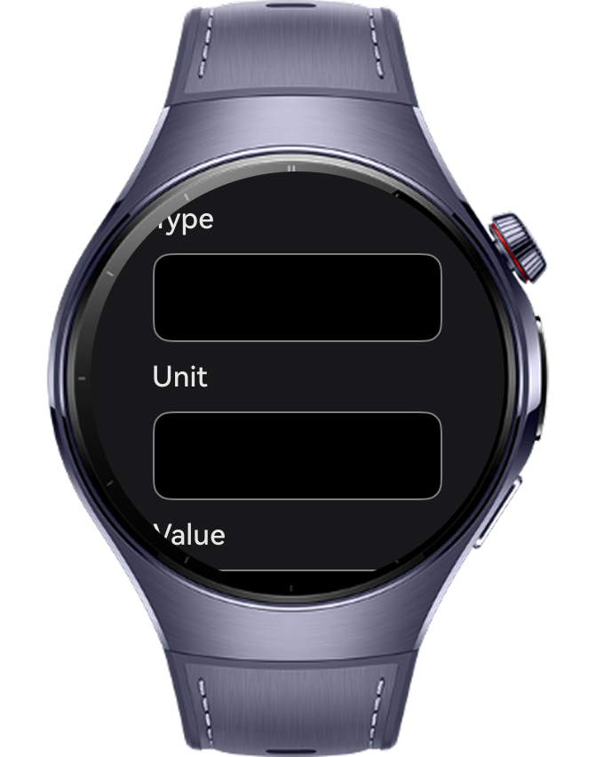
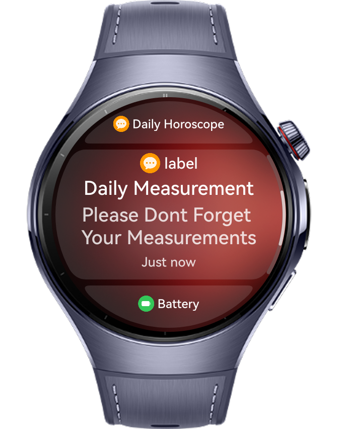

> **Note:** To access all shared projects, get information about environment setup, and view other guides, please visit [Explore-In-HMOS-Wearable Index](https://github.com/Explore-In-HMOS-Wearable/hmos-index).

# Diabetes Tracker App

DiabetesTracker is a comprehensive health management application designed specifically for smartwatches, empowering individuals with diabetes to effortlessly track and manage their condition right from their wrist.

# Preview

<div>
  
  
  
  
</div>


# Use Cases

1. Users needs to authenticate in App to save their measurement data.
2. User can take measurements regularly and track the results by date
3. Users can get reminder notifications to not forget the measurements

# Technology

## Stack

- **Languages**: ArkTS, ArkUI
- **Frameworks**: HarmonyOS 5.1.0(18)
- **Tools**: DevEco Studio Vers 5.1.0.828SP1,
- **Libraries**: @kit.ArkUI, @kit.AbilityKit, @kit.BasicServicesKit, @kit.BackgroundTasksKit, @kit.NotificationKit, @kit.SensorServiceKit, @ohos.data.relationalStore, @ohos.data.preferences

## Required Permissions

- `ohos.permission.PUBLISH_AGENT_REMINDER`
  > Required to publish and manage agent reminders
- `ohos.permission.KEEP_BACKGROUND_RUNNING`
  > Required to keep the application running in the background for reminders
- `ohos.permission.INTERNET`
  > Required to use and connect to internet


# Directory Structure

```

├───data
│       MainMenuItems.ets
│
├───entryability
│       EntryAbility.ets
│
├───entrybackupability
│       EntryBackupAbility.ets
│
├───pages
│       Index.ets
│       MeasurementPage.ets
│       RegistrationPage.ets
│       SplashScreen.ets
│       UserPage.ets
│
├───services
│       NotificationService.ets
│
├───types
│       MainMenuItem.ets
│       Measurement.ets
│       User.ets
│
└───utils
        DataManager.ets
        PreferencesManager.ets


```

# Constraints and Restrictions

## Suported Devices

- Huawei Watch 5

## Limitations

- DiabetesTracker is not working on previewer or simulators

# License

**DiabetesTrackerApp** is distributed under the terms of the MIT License
See the [LICENSE](../../Downloads/LICENSE) for more information.


